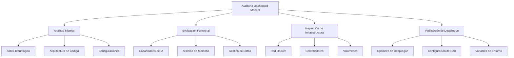

# Diseño de Auditoría Completa del Microservicio Dashboard-Monitor

## Visión General

Este documento presenta el diseño detallado para realizar una auditoría técnica completa del microservicio **dashboard-monitor** (MPD Insights) con el objetivo de **refactorizar y mejorar** el proyecto existente. La auditoría se estructura como un análisis sistemático que abarca desde la arquitectura técnica hasta las capacidades operacionales, con especial énfasis en la integración con la infraestructura Docker existente y las capacidades de inteligencia artificial.

**Objetivo Principal:** Realizar una auditoría activa que resulte en la refactorización completa del dashboard-monitor, implementando mejoras identificadas en arquitectura, funcionalidades de IA, gestión de datos y configuración de despliegue.

El diseño de auditoría se basa en un enfoque metodológico que combina análisis estático de código, inspección de infraestructura, evaluación de capacidades funcionales y **implementación de mejoras** basadas en los hallazgos.

## Arquitectura de la Auditoría

### Componentes Principales



### Flujo de Auditoría

La auditoría seguirá un flujo secuencial pero iterativo:

1. **Análisis de Arquitectura**: Evaluación del stack tecnológico y decisiones de diseño
2. **Inspección de Infraestructura**: Documentación completa de la configuración Docker actual
3. **Evaluación de Capacidades**: Análisis de funcionalidades de IA y gestión de datos
4. **Verificación de Seguridad**: Revisión de conectividad y permisos de base de datos
5. **Análisis de Despliegue**: Evaluación de opciones y recomendaciones
6. **Documentación de Hallazgos**: Consolidación de resultados y recomendaciones

## Componentes y Interfaces

### 1. Módulo de Análisis Técnico

**Responsabilidades:**
- Análisis del stack tecnológico (Next.js 15, TypeScript, Tailwind CSS)
- Evaluación de la arquitectura de componentes
- Revisión de configuraciones de build y desarrollo
- Análisis de dependencias y librerías utilizadas

**Interfaces:**
- Lectura de archivos de configuración (`package.json`, `next.config.ts`, `tsconfig.json`)
- Análisis de estructura de directorios y organización de código
- Evaluación de patrones de diseño implementados

### 2. Módulo de Evaluación de IA

**Responsabilidades:**
- Análisis del sistema unificado de consultas inteligentes
- Evaluación del sistema de prompting especializado
- Inspección del sistema de memoria vectorial y modelo de embeddings
- Verificación de la flexibilidad multi-proveedor de IA

**Interfaces:**
- Análisis de flujos de IA en `/src/ai/flows/`
- Evaluación de la configuración de Genkit
- Inspección del volumen `dashboard-monitor_vector_store`
- Configuración del modelo de embeddings (recomendado: Sentence Transformers para soporte offline y multiidioma)
- Verificación de prompts especializados

### 3. Módulo de Inspección de Infraestructura

**Responsabilidades:**
- Documentación completa de la red Docker `mpd_concursos_mpd-concursos-network`
- Análisis de contenedores activos y sus configuraciones
- Inspección de volúmenes de datos persistentes
- Verificación de conectividad entre servicios

**Interfaces:**
- Comandos Docker para inspección de red, contenedores y volúmenes
- Análisis de configuraciones de red (172.18.0.0/16)
- Verificación de puertos expuestos y mapeos

### 4. Módulo de Evaluación de Base de Datos

**Responsabilidades:**
- Verificación de acceso completo e irrestricto a la base de datos
- Análisis de la introspección dinámica del esquema
- Evaluación de capacidades de consulta SQL
- Verificación de permisos y credenciales

**Interfaces:**
- Conexión directa a MySQL en `mpd-concursos-mysql:3306`
- Utilización de INFORMATION_SCHEMA para introspección
- Ejecución de consultas de prueba y verificación de permisos

### 5. Módulo de Gestión de Datos

**Responsabilidades:**
- Evaluación de capacidades de gestión de usuarios
- Análisis de funcionalidades de gestión de documentos
- Verificación de sistemas de backup y restauración
- Inspección de métricas y estadísticas del sistema

**Interfaces:**
- Análisis de páginas de gestión en `/src/app/(dashboard)/`
- Verificación de volúmenes de almacenamiento
- Evaluación de interfaces de usuario para administración

## Modelos de Datos

### Estructura de Auditoría

```typescript
interface AuditResult {
  timestamp: Date;
  version: string;
  sections: {
    technical: TechnicalAnalysis;
    infrastructure: InfrastructureAnalysis;
    ai: AICapabilitiesAnalysis;
    database: DatabaseAnalysis;
    deployment: DeploymentAnalysis;
  };
  recommendations: Recommendation[];
  riskAssessment: RiskLevel;
}

interface TechnicalAnalysis {
  stack: {
    framework: string;
    language: string;
    ui: string[];
    ai: string;
    database: string;
  };
  architecture: {
    pattern: string;
    organization: string;
    buildConfig: BuildConfiguration;
  };
  dependencies: Dependency[];
}

interface InfrastructureAnalysis {
  network: {
    name: string;
    subnet: string;
    gateway: string;
  };
  containers: ContainerInfo[];
  volumes: VolumeInfo[];
  connectivity: ConnectivityTest[];
}

interface AICapabilitiesAnalysis {
  unifiedQuery: {
    implemented: boolean;
    promptingStrategy: string;
    multiProvider: boolean;
  };
  vectorMemory: {
    volume: string;
    persistence: boolean;
    searchCapability: boolean;
    embeddingModel: {
      provider: string;
      model: string;
      dimensions: number;
      language: string;
    };
  };
  flows: AIFlow[];
}
```

### Configuración de Despliegue

```typescript
interface DeploymentOption {
  type: 'container' | 'direct' | 'compose';
  recommended: boolean;
  configuration: {
    network: string;
    port: number;
    volumes: string[];
    environment: EnvironmentVariable[];
  };
  pros: string[];
  cons: string[];
}
```

## Manejo de Errores

### Estrategias de Recuperación

1. **Errores de Conectividad Docker**
   - Verificación de servicios Docker activos
   - Reintentos con backoff exponencial
   - Fallback a análisis estático si no hay acceso a contenedores

2. **Errores de Base de Datos**
   - Verificación de credenciales y conectividad
   - Análisis de logs de contenedor MySQL
   - Documentación de limitaciones de acceso

3. **Errores de Análisis de Código**
   - Manejo de archivos faltantes o corruptos
   - Análisis parcial con advertencias
   - Documentación de limitaciones encontradas

### Logging y Monitoreo

```typescript
interface AuditLog {
  level: 'info' | 'warn' | 'error';
  timestamp: Date;
  component: string;
  message: string;
  context?: any;
}
```

## Estrategia de Testing

### Verificaciones Automatizadas

1. **Tests de Conectividad**
   - Verificación de acceso a contenedores Docker
   - Pruebas de conectividad de red
   - Validación de credenciales de base de datos

2. **Tests de Funcionalidad**
   - Verificación de endpoints de la aplicación
   - Pruebas de consultas de IA
   - Validación de sistema de memoria vectorial

3. **Tests de Configuración**
   - Verificación de variables de entorno
   - Validación de configuraciones de build
   - Pruebas de configuración de despliegue

### Métricas de Calidad

```typescript
interface QualityMetrics {
  completeness: number; // 0-100%
  accuracy: number; // 0-100%
  performance: {
    queryResponseTime: number;
    memoryUsage: number;
    cpuUsage: number;
  };
  security: {
    vulnerabilities: number;
    exposedPorts: number;
    credentialSecurity: SecurityLevel;
  };
}
```

## Consideraciones de Seguridad

### Acceso a Datos Sensibles

1. **Credenciales de Base de Datos**
   - Uso de credenciales root para acceso completo
   - Documentación de permisos y limitaciones
   - Recomendaciones de seguridad para producción

2. **Datos de Producción**
   - Manejo cuidadoso de datos reales del sistema de concursos
   - Anonimización de datos sensibles en reportes
   - Cumplimiento con políticas de privacidad

3. **Configuraciones de Red**
   - Análisis de exposición de puertos
   - Verificación de aislamiento de red
   - Documentación de vectores de ataque potenciales

### Recomendaciones de Seguridad

1. **Implementar autenticación para el dashboard**
2. **Configurar HTTPS para comunicaciones**
3. **Implementar rate limiting para APIs**
4. **Configurar logs de auditoría para accesos**
5. **Implementar backup cifrado para datos sensibles**

## Optimización de Rendimiento

### Estrategias de Optimización

1. **Cache de Consultas**
   - Implementación de cache Redis para consultas frecuentes
   - Optimización de consultas SQL complejas
   - Cache de resultados de IA para consultas similares

2. **Optimización de Memoria Vectorial**
   - Configuración óptima del tamaño de embeddings
   - Implementación de limpieza automática de memoria antigua
   - Optimización de búsquedas por similitud

3. **Optimización de Red**
   - Configuración de connection pooling para MySQL
   - Optimización de timeouts de red
   - Implementación de health checks

### Métricas de Rendimiento

```typescript
interface PerformanceMetrics {
  queryLatency: {
    p50: number;
    p95: number;
    p99: number;
  };
  throughput: {
    queriesPerSecond: number;
    concurrentUsers: number;
  };
  resources: {
    memoryUsage: number;
    cpuUsage: number;
    diskUsage: number;
  };
}
```

## Plan de Implementación

### Fases de Ejecución

1. **Fase 1: Preparación** (1 día)
   - Configuración del entorno de auditoría
   - Verificación de accesos y permisos
   - Preparación de herramientas de análisis

2. **Fase 2: Análisis Técnico** (2 días)
   - Análisis de arquitectura y stack tecnológico
   - Evaluación de código y configuraciones
   - Documentación de patrones y decisiones de diseño

3. **Fase 3: Inspección de Infraestructura** (1 día)
   - Análisis completo de la configuración Docker
   - Documentación de red, contenedores y volúmenes
   - Verificación de conectividad y rendimiento

4. **Fase 4: Evaluación Funcional** (2 días)
   - Análisis de capacidades de IA
   - Evaluación del sistema de memoria vectorial
   - Verificación de funcionalidades de gestión de datos

5. **Fase 5: Análisis de Despliegue** (1 día)
   - Evaluación de opciones de despliegue
   - Configuración recomendada para contenedor Docker
   - Documentación de procedimientos de despliegue

6. **Fase 6: Consolidación** (1 día)
   - Consolidación de hallazgos
   - Generación de reporte final
   - Presentación de recomendaciones

### Entregables

1. **Reporte de Auditoría Técnica**
   - Análisis completo de arquitectura y tecnologías
   - Evaluación de capacidades funcionales
   - Documentación de infraestructura

2. **Plan de Despliegue Recomendado**
   - Configuración Docker detallada
   - Scripts de despliegue automatizado
   - Procedimientos de mantenimiento

3. **Recomendaciones de Mejora**
   - Optimizaciones de rendimiento
   - Mejoras de seguridad
   - Actualizaciones tecnológicas

4. **Documentación Técnica**
   - Diagramas de arquitectura actualizados
   - Documentación de APIs y interfaces
   - Guías de operación y mantenimiento