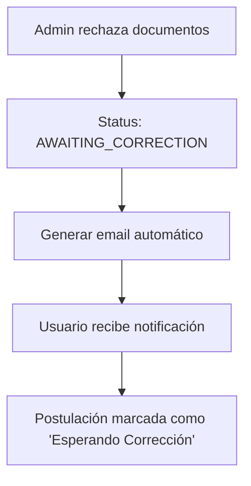
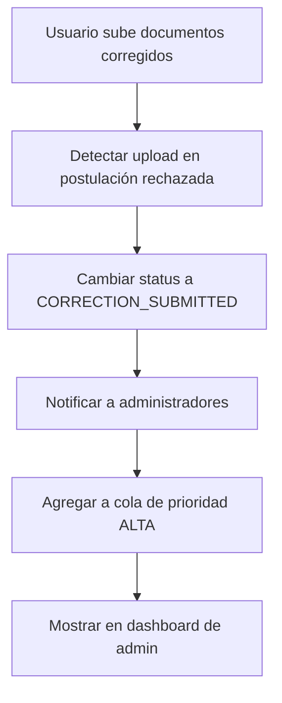
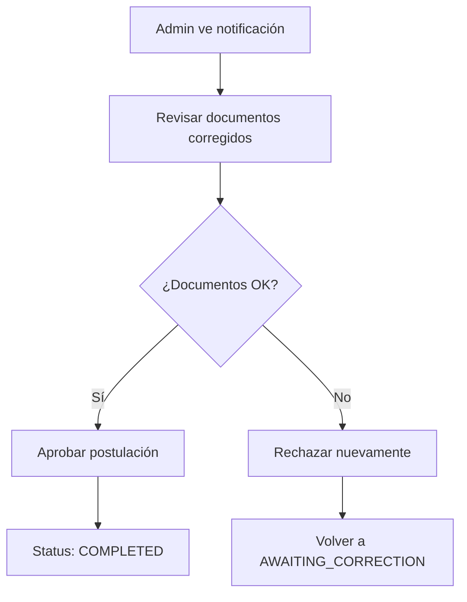

# 📋 Sistema de Monitoreo de Re-subidas de Documentos
## Propuesta de Mejora para Flujo de Correcciones

**Fecha:** 16 de agosto de 2025  
**Problema:** Inconsistencia en el flujo de corrección de documentos rechazados  
**Estado:** Propuesta para Implementación

---

## 🚨 **Problema Actual**

### **Gap en el Flujo:**
1. ✅ **Admin rechaza documentos** → Sistema genera email de corrección
2. ✅ **Usuario recibe email** → Sabe que debe corregir documentos
3. ❓ **Usuario sube documentos nuevos** → **¿Cómo se entera el admin?**
4. ❌ **Admin NO tiene notificación** → No sabe que hay documentos nuevos para revisar

### **Consecuencias:**
- 📉 **Retrasos en procesamiento** de correcciones
- 😤 **Frustración del usuario** (sube docs pero no recibe respuesta)
- 🔍 **Búsqueda manual** por parte del admin
- ⚠️ **Pérdida de documentos** en corrección

---

## 🎯 **Solución Propuesta**

### **1. Nuevos Estados de Postulación**

#### **Estados Actuales:**
```typescript
type InscriptionStatus = 
  | 'ACTIVE' 
  | 'APPROVED' 
  | 'CANCELLED' 
  | 'COMPLETED_PENDING_DOCS' 
  | 'COMPLETED_WITH_DOCS' 
  | 'FROZEN' 
  | 'PENDING' 
  | 'REJECTED'
```

#### **Estados Propuestos (Agregar):**
```typescript
type InscriptionStatus = 
  // ... estados actuales
  | 'AWAITING_CORRECTION'     // Documentos rechazados, esperando corrección
  | 'CORRECTION_SUBMITTED'    // Usuario subió correcciones, requiere revisión
  | 'UNDER_REVIEW'           // En proceso de validación (opcional)
```

### **2. Estados de Validación Mejorados**

#### **Estados Actuales:**
```typescript
type ValidationStatus = 'PENDING' | 'PARTIAL' | 'COMPLETED' | 'REJECTED'
```

#### **Estados Propuestos (Agregar):**
```typescript
type ValidationStatus = 
  // ... estados actuales
  | 'AWAITING_CORRECTION'     // Rechazado, esperando que usuario corrija
  | 'CORRECTION_PENDING'      // Usuario subió corrección, admin debe revisar
  | 'UNDER_REVISION'         // Admin está revisando correcciones
```

---

## 🔄 **Flujo Mejorado de Correcciones**

### **Fase 1: Rechazo de Documentos**


### **Fase 2: Re-subida de Documentos**


### **Fase 3: Re-validación**


---

## 🛠️ **Implementación Técnica**

### **1. Dashboard de Administración**

#### **Nueva Sección: "Correcciones Pendientes"**
```tsx
// Componente propuesto
<PostulationCard
  postulation={{
    ...postulation,
    validationStatus: "CORRECTION_PENDING",
    priority: "HIGH", // Siempre alta prioridad
    hasNewDocuments: true,
    lastUploadDate: "2025-08-16T10:30:00Z"
  }}
/>
```

#### **Indicadores Visuales:**
- 🔔 **Badge "Nueva Corrección"** en tarjetas
- 📅 **Timestamp** de última subida
- ⚡ **Prioridad ALTA automática** para correcciones
- 📊 **Contador** de correcciones pendientes

### **2. Sistema de Notificaciones**

#### **Notificaciones en Tiempo Real:**
```typescript
interface NotificationSystem {
  onDocumentUpload: (postulationId: string, dni: string) => void;
  sendAdminAlert: (message: string, type: 'correction_submitted') => void;
  updateDashboardCounters: () => void;
}
```

#### **Tipos de Notificaciones:**
- 🔔 **Push notifications** en dashboard
- 📧 **Email a administradores** (opcional)
- 📊 **Counters actualizados** en tiempo real
- 🎯 **Filtros especiales** para correcciones

### **3. API Endpoints Nuevos**

```typescript
// Nuevas rutas propuestas
GET  /api/postulations/corrections-pending     // Lista correcciones pendientes
GET  /api/postulations/awaiting-correction    // Lista postulaciones esperando corrección
POST /api/postulations/{id}/mark-corrected    // Marcar como corregido por usuario
POST /api/notifications/correction-submitted  // Notificar corrección
```

### **4. Base de Datos**

#### **Tabla de Eventos (Nueva):**
```sql
CREATE TABLE postulation_events (
    id UUID PRIMARY KEY,
    postulation_id UUID NOT NULL,
    event_type VARCHAR(50) NOT NULL, -- 'CORRECTION_SUBMITTED', 'DOCUMENTS_REJECTED', etc.
    event_date TIMESTAMP DEFAULT NOW(),
    admin_user_id UUID,
    metadata JSONB, -- { documentIds: [], reason: '', etc. }
    INDEX idx_postulation_events_date (postulation_id, event_date)
);
```

#### **Campos Nuevos en Postulaciones:**
```sql
ALTER TABLE inscriptions ADD COLUMN last_document_upload TIMESTAMP;
ALTER TABLE inscriptions ADD COLUMN correction_count INTEGER DEFAULT 0;
ALTER TABLE inscriptions ADD COLUMN awaiting_admin_review BOOLEAN DEFAULT FALSE;
```

---

## 📊 **Dashboard Mejorado**

### **Sección: "Correcciones Pendientes"**
```
┌─────────────────────────────────────────────────────┐
│ 🔔 Correcciones Pendientes (3)                     │
├─────────────────────────────────────────────────────┤
│ ⚡ ALTA  📅 Hace 2 horas  👤 Juan Pérez             │
│    DNI: 12.345.678 • Nueva documentación subida    │
│    📄 2 documentos corregidos                       │
│                                            [Revisar]│
├─────────────────────────────────────────────────────┤
│ ⚡ ALTA  📅 Hace 5 horas  👤 María García            │
│    DNI: 87.654.321 • Documentos re-subidos          │
│    📄 3 documentos corregidos                       │
│                                            [Revisar]│
└─────────────────────────────────────────────────────┘
```

### **Filtros Nuevos:**
- 🔔 **"Correcciones Pendientes"**
- ⏳ **"Esperando Corrección del Usuario"**
- 🔄 **"En Re-validación"**

---

## 🎯 **Beneficios de la Solución**

### **Para Administradores:**
- ✅ **Visibilidad inmediata** de correcciones nuevas
- ⚡ **Priorización automática** de re-subidas
- 📊 **Métricas claras** de eficiencia de correcciones
- 🔍 **Búsqueda fácil** de postulaciones en corrección

### **Para Usuarios:**
- 📝 **Feedback claro** sobre el estado de sus correcciones
- ⏱️ **Tiempos de respuesta** más rápidos
- 🎯 **Transparencia** en el proceso
- 📧 **Notificaciones** de cambios de estado

### **Para el Sistema:**
- 🔄 **Flujo completo** sin gaps
- 📈 **Métricas** de tiempo de corrección
- 🛡️ **No se pierden documentos** en el proceso
- ⚡ **Procesamiento eficiente**

---

## 🚀 **Fases de Implementación**

### **Fase 1: Estados y Backend (Prioridad Alta)**
- [ ] Agregar nuevos estados a la base de datos
- [ ] Implementar API endpoints para correcciones
- [ ] Crear tabla de eventos de postulación
- [ ] Implementar lógica de detección de re-subidas

### **Fase 2: Dashboard y UI (Prioridad Alta)**
- [ ] Crear sección "Correcciones Pendientes"
- [ ] Agregar badges y indicadores visuales
- [ ] Implementar filtros nuevos
- [ ] Mejorar priorización automática

### **Fase 3: Notificaciones (Prioridad Media)**
- [ ] Sistema de push notifications
- [ ] Email alerts para administradores
- [ ] Counters en tiempo real
- [ ] Historial de eventos

### **Fase 4: Métricas y Reportes (Prioridad Baja)**
- [ ] Dashboard de métricas de correcciones
- [ ] Reportes de eficiencia
- [ ] Analytics de tiempo de respuesta
- [ ] Alertas por demoras

---

## 💡 **Consideraciones Adicionales**

### **Reglas de Negocio:**
- 📅 **Timeout de correcciones:** ¿Cuánto tiempo tiene el usuario para corregir?
- 🔢 **Máximo de correcciones:** ¿Límite de veces que puede corregir?
- ⏰ **SLA de respuesta:** ¿Tiempo máximo para que admin revise corrección?

### **Notificaciones al Usuario:**
- 📧 **Email cuando admin revisa** la corrección
- 🔔 **Notificación de aprobación/rechazo** de la corrección
- 📊 **Status updates** en su panel de usuario

### **Métricas de Éxito:**
- ⏱️ **Tiempo promedio** de corrección
- 📈 **Tasa de éxito** en re-subidas
- 🎯 **Satisfacción** del usuario
- 💪 **Eficiencia** del equipo administrativo

---

## 🎯 **Conclusión**

Esta propuesta resuelve completamente el **gap crítico** identificado en el flujo de correcciones, creando un sistema robusto, eficiente y transparente que beneficia tanto a administradores como a usuarios.

**Prioridad de Implementación:** ⚡ **ALTA** - Este problema afecta directamente la experiencia del usuario y la eficiencia operativa.

---

**Documento preparado por:** Sistema de Análisis IA  
**Para:** Equipo de Desarrollo MPD Dashboard  
**Estado:** Listo para Revisión e Implementación
