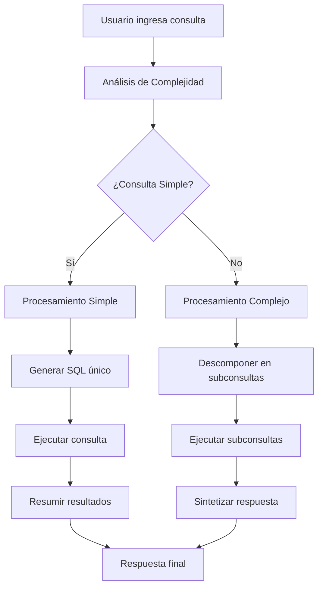

# Sistema de Consultas Inteligentes Unificado

## Descripción

El sistema de consultas inteligentes unificado reemplaza los dos sistemas separados de consulta (natural y compleja) con una única interfaz que automáticamente determina la complejidad de la consulta y aplica el procesamiento apropiado.

## Arquitectura

### Componentes Principales

1. **Intelligent Query Router** (`src/ai/flows/intelligent-query-router.ts`)
   - Analizador de complejidad de consultas
   - Enrutador automático a procesamiento simple o complejo
   - Unificación de respuestas

2. **Unified Query Action** (`src/lib/actions.ts` - `handleUnifiedQuery`)
   - Validación de entrada
   - Llamada al router inteligente
   - Formateo de respuesta

3. **Unified Query Page** (`src/app/(dashboard)/unified-query/page.tsx`)
   - Interfaz única para todas las consultas
   - Visualización de tipo de consulta y métricas
   - Mostrar consultas SQL ejecutadas

## Flujo de Procesamiento



## Criterios de Clasificación

### Consultas Simples
- Preguntas directas que requieren una sola consulta SQL
- Solicitudes de datos específicos (conteos, listas, valores únicos)
- No requieren análisis o síntesis de múltiples fuentes
- **Ejemplos**: "¿Cuántos usuarios hay?", "Lista los concursos activos"

### Consultas Complejas
- Requieren múltiples consultas SQL relacionadas
- Solicitudes de análisis, comparaciones o tendencias
- Requieren síntesis de información de múltiples tablas
- Preguntas abiertas que requieren interpretación
- **Ejemplos**: "Analiza el rendimiento de los concursos", "¿Qué patrones ves en las inscripciones?"

## Ventajas del Sistema Unificado

1. **Experiencia de Usuario Simplificada**
   - Una sola interfaz para todas las consultas
   - No necesidad de elegir entre tipos de consulta

2. **Procesamiento Inteligente**
   - Determinación automática de complejidad
   - Optimización del procesamiento según el tipo

3. **Transparencia**
   - Muestra el tipo de procesamiento utilizado
   - Visualiza las consultas SQL ejecutadas
   - Métricas de calidad y tiempo de procesamiento

4. **Mantenibilidad**
   - Código centralizado y reutilizable
   - Eliminación de duplicación
   - Fácil extensión y mejora

## Migración

### Páginas Reemplazadas
- `/ai-query` (Consulta con IA)
- `/natural-query` (Consulta Natural)

### Nueva Página
- `/unified-query` (Consulta Inteligente)

### Navegación Actualizada
La barra lateral ahora muestra una única opción "Consulta Inteligente" en lugar de las dos opciones separadas.

## Implementación Técnica

### Prompts Especializados

1. **Analizador de Complejidad**: Determina si una consulta requiere procesamiento simple o complejo
2. **Generador SQL Simple**: Crea consultas SQL directas para preguntas simples
3. **Planificador Complejo**: Descompone consultas complejas en subconsultas
4. **Sintetizador**: Combina resultados de múltiples consultas en una respuesta coherente

### Tipos de Respuesta

```typescript
interface IntelligentQueryOutput {
  answer: string;                    // Respuesta final al usuario
  queryType: 'simple' | 'complex';  // Tipo de procesamiento usado
  sqlQueries: string[];              // Consultas SQL ejecutadas
  processingTime: string;            // Tiempo de procesamiento
  queryQuality: string;              // Evaluación de calidad
}
```

## Configuración

El sistema utiliza la configuración existente de Genkit y se conecta automáticamente a la base de datos configurada. No requiere configuración adicional.

## Monitoreo

El sistema proporciona métricas de:
- Tiempo de procesamiento
- Calidad de respuesta
- Tipo de consulta procesada
- Consultas SQL ejecutadas

Estas métricas ayudan a entender el rendimiento y la efectividad del sistema unificado.